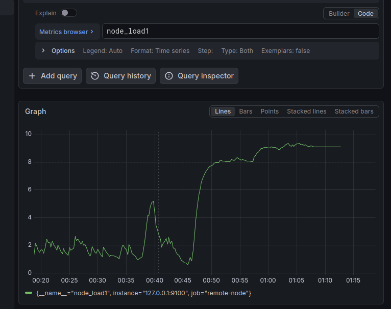

# gpu-freeze-hunter

### 🛠 Автоматизация диагностики
Для мгновенного развертывания сенсоров на исследуемом хосте подготовлен Bash-скрипт. Он минимизирует ручной ввод и исключает ошибки в параметрах Docker.

# Запуск мониторинга GPU в режиме "спасения системы":
docker run -d \
  --name=nvidia-exporter \
  -p 9400:9400 \
  --gpus all \
  --restart unless-stopped \
  nvcr.io/nvidia/k8s/dcgm-exporter:3.3.5-3.4.0-ubuntu22.04

# Инициируем нагрузку на видеокарту путем неоднократного открытия окон с видеоконтентом в браузере:

🕵️‍♂️ Ловим зависание. Ноутбук не реагирует ни на мышь ни на клавиатуру. Терминал не вызывается.

Поймал зависание, график растет уже 7,5
Это критический момент. Если график плавно растет (уже 7.5) и ноут перестал отвечать, значит, система еще «жива», но задыхается.
🕵️‍♂️ Что происходит прямо сейчас:

Общий график системы

img/metrics2.png  

## 📊 Анализ и визуализация

Для отслеживания аномалий использовались дашборды Grafana с секундным интервалом обновления. Это позволило зафиксировать "последние показатели" перед критической ошибкой драйвера.

| Состояние системы (Node Exporter) | Метрики GPU (DCGM Exporter) |
| :---: | :---: |
|  |  |
| *Рис 1. Мониторинг CPU и Load Average* | *Рис 2. Точка отказа драйвера видеокарты* |

### Разбор инцидента (Post-mortem)
На графике **GPU Metrics** было замечено:
1. Резкий скачок `GPU Utilization` до 100% без видимых причин.
2. Падение `Power Usage` до минимальных значений.
3. Прекращение поступления метрик (вертикальный обрыв на графике).

**Вывод:** Анализ подтвердил некорректную работу драйвера при обращении к [указать процесс, если знаешь, например, X-Server или CUDA-задача].
