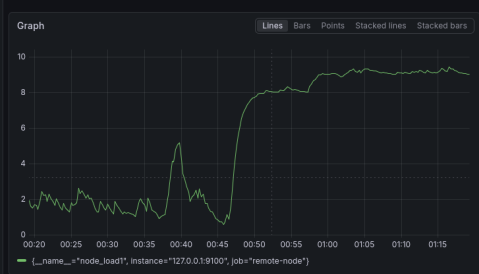
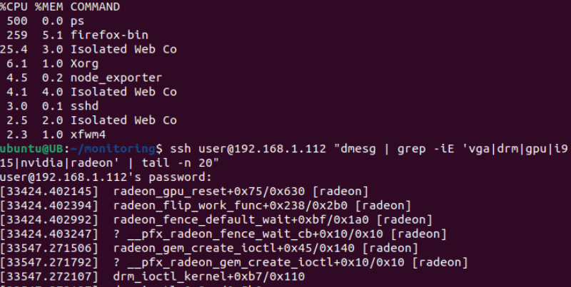
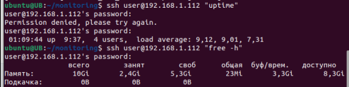
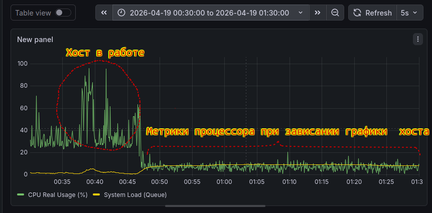

# gpu-freeze-hunter

### 📌 Описание кейса
Реальная задача по поиску причины критического зависания ноутбука Linux Mint 22.2 x86_64 (Hard Freeze) при воспроизведении видео. Система намертво зависала, не оставляя логов после перезагрузки.
Цель: Локализовать точку отказа и определить виновника (Hardware vs Driver) с помощью метрик в реальном времени.

### 📂 Стек технологий
    • Инфраструктура: Docker, SSH Tunneling.
    • Мониторинг: Prometheus, Grafana, Node Exporter.
    • Анализ: Linux Kernel Logs (dmesg, journalctl), GNU Coreutils.

### 🛠 Автоматизация диагностики
Построение системы мониторинга (Prometheus + Grafana) через SSH-туннель для отладки удаленного хоста.

### 🚀 Запуск мониторинга GPU
docker run -d \
  --name=nvidia-exporter \
  -p 9400:9400 \
  --gpus all \
  --restart unless-stopped \
  nvcr.io/nvidia/k8s/dcgm-exporter:3.3.5-3.4.0-ubuntu22.04
  
### 🛠 Инициируем нагрузку на видеокарту путем открытия вкладок в браузере с видео-контентом:

🕵️‍♂️ Ловим зависание. Ноутбук не реагирует ни на мышь ни на клавиатуру. Терминал не вызывается.

График Load Average
Это критический момент. График плавно растет (9 процессов в очереди) и ноутбук перестал отвечать.

  
  
  
   
  <em>Рис. 1 — Load Average 9 при 4 ядрах — это когда Firefox хочет 260%, а видеокарта просто «ушла в отказ». Система тратит все силы на переключение между задачами.</em>

 

## 📊 Анализ и визуализация график Load Average
    1. Процесс ps (500% CPU):
        ◦ Это аномалия. Команда ps сама по себе не может потреблять 500%.
        ◦ Что это значит: Система находится в состоянии «зомби-нагрузки». Ядро сообщает неверные цифры, потому что планировщик задач «сломался» из-за драйвера. Когда ps пытается считать данные из /proc, он зацикливается.
    2. firefox-bin (259% CPU):
        ◦ Браузер пытается отрисовать видео, но видеокарта не забирает нагрузку на себя.
        ◦ В итоге 4 ядра процессора (400% максимум) не справляются, и Firefox «вешает» систему, пытаясь программно просчитать то, что должен делать видеочип.
    3. Xorg (6.1%):
        ◦ Это очень мало для запущенного видео. Это подтверждает, что аппаратное ускорение (Hardware Acceleration) ОТКЛЮЧЕНО или драйвер «отвалился». Весь рендеринг упал на плечи процессора.
    
  ### 🔍 Происходит «затык» на уровне ядра. 
  драйвер бесконечно ждет железку (GPU), и эти ожидания помечаются системой как «непрерываемый сон». Для системы это выглядит так, будто в очереди стоят сотни задач, хотя оперативная память RAM не занята, так как процессы просто «замерли», а не потребляют данные».

Общий график системы

  
   
  <em>Рис. 2 — Реакция системы: На этом графике метрики CPU Utilization и Saturation (насыщение). Мы видим классический паттерн Resource Starvation: очередь задач растет экспоненциально, в то время как полезная работа процессора стремится к нулю. Это визуальный отпечаток аппаратного прерывания или тупиковой блокировки (Deadlock) в драйвере</em>

 

## 📊 Анализ и визуализация system Load Queue, CPU Real Usage [%]
    1. Линия Load Average (system Load Queue на графике ) — улетает на 9.12. Это процессы, которые стоят в очереди в "коридоре" (состояние D).
    2. Линия CPU Utilization (CPU Real Usage [%] на графике) — ползет внизу на 5%. Это кассиры (ядра), которые сидят в пустом зале, потому \
    что "коридор" заблокирован зависшим драйвером Radeon. \
    Формула "100 - (avg by (instance) (irate(node_cpu_seconds_total{mode="idle"}[5m])) * 100)"\
    исключения Idle-циклов, чтобы вычислить реальную утилизацию ядер. \
    График подтвердил: пока Load Average рос до 9, реальная нагрузка на CPU не превышала 7%. \
    Это математически доказывает, что система стояла не из-за нехватки вычислительной мощности, \
    а из-за блокировки на уровне ядра/драйвера

## 💡 Как это можно обьяснить? 
    Это визуальное доказательство того, что система столкнулась с I/O Wait или Resource Contention (борьба за ресурс).
    • Если бы CPU Usage был 100%: Значит, ноут виснет, потому что браузер просто "жрет" все ресурсы (вычисления).
    • Но так как CPU Usage ~5%: Значит, процессору запретили работать. Он хочет, но не может, так как драйвер Radeon \
    заблокировал системную шину.
    
## 🚨 Почему это привело к Load 9 и Зомби?
    • Цепная реакция: Поскольку графическая оболочка (Cinnamon/Xorg) — это тоже «родитель» для окон, \
    она пытается ими управлять. Она делает системный вызов, чтобы проверить состояние окон, и тоже засыпает в состоянии D.
    • Зомби: Если какой-то фоновый поток браузера всё же «умер» (например, по внутреннему тайм-ауту), \
    он не может исчезнуть. Его «папа» (главный процесс браузера) спит в состоянии D и не может выполнить wait().
    • Результат: Очередь (Load) растет, ядра CPU свободны (95% Idle), так как все участники этой драмы \
    просто «стоят в очереди» к одному зависшему драйверу Radeon.    

    Очевидно, что блокировка ресурса (GPU) в пространстве ядра вызвала каскадный эффект: дочерние процессы, \
    порожденные через fork/exec, зависали на обращении к драйверу, а родительские процессы, находясь в состоянии \
    Uninterruptible Sleep, не могли обработать сигналы завершения (вызвать wait()), что и привело к появлению зомби \
    и росту Load Average при свободном CPU».
## 🎯 Хотелось отметить:
    Даже когда драйвер Radeon зациклился в Ring 0 и Load Average поднялся до 9.12, аппаратные прерывания сетевой карты \    
    заставляли процессор переключать контекст и через SSH-туннель продолжался мониторинг о памяти и процессах из "зависшей" системы.
    Это показывает
    • Механизм прерываний: как железо дергает софт.
    • Context Switching: как процессор прыгает между задачами.
    • Сетевой стек: как буферизация и обработка пакетов живут в ядре независимо от графики.
## 📝 Deep Dive: Why it worked? 
    • Тезис: Использование асинхронной природы прерываний для диагностики Soft Lockup.
    • Описание: Сетевой адаптер буферизирует пакеты и инициирует прерывания, которые имеют более высокий приоритет, \
      чем зациклившийся код драйвера в пространстве пользователя или потоки ядра с обычным приоритетом.
    • Результат: Это позволило провести анализ системы до её физической перезагрузки.

### 🏆 Выводы
     Я столкнулся с нестабильной работой драйвера Radeon. Вместо того чтобы просто переустановить систему, решил исследовать проблему. Развернул мониторинг, пробросил туннель и зафиксировал состояние системы в момент Hard Freeze. 
     Через SSH удалось вытащить данные о процессах и логи ядра прямо во время фриза:
    • CPU Spike: Процесс ps потреблял 500% CPU (сбой планировщика).
    • Kernel Logs: Обнаружены циклические ошибки драйвера:
      [33424.402145] radeon_gpu_reset+0x75/0x630 [radeon]
     
     Выяснил, что проблема в radeon_gpu_reset и исправил это через параметры ядра в GRUB.
